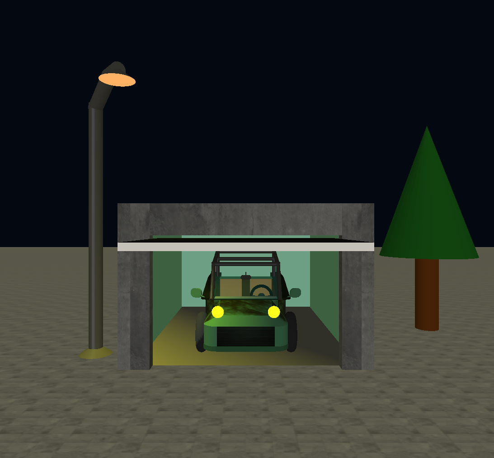
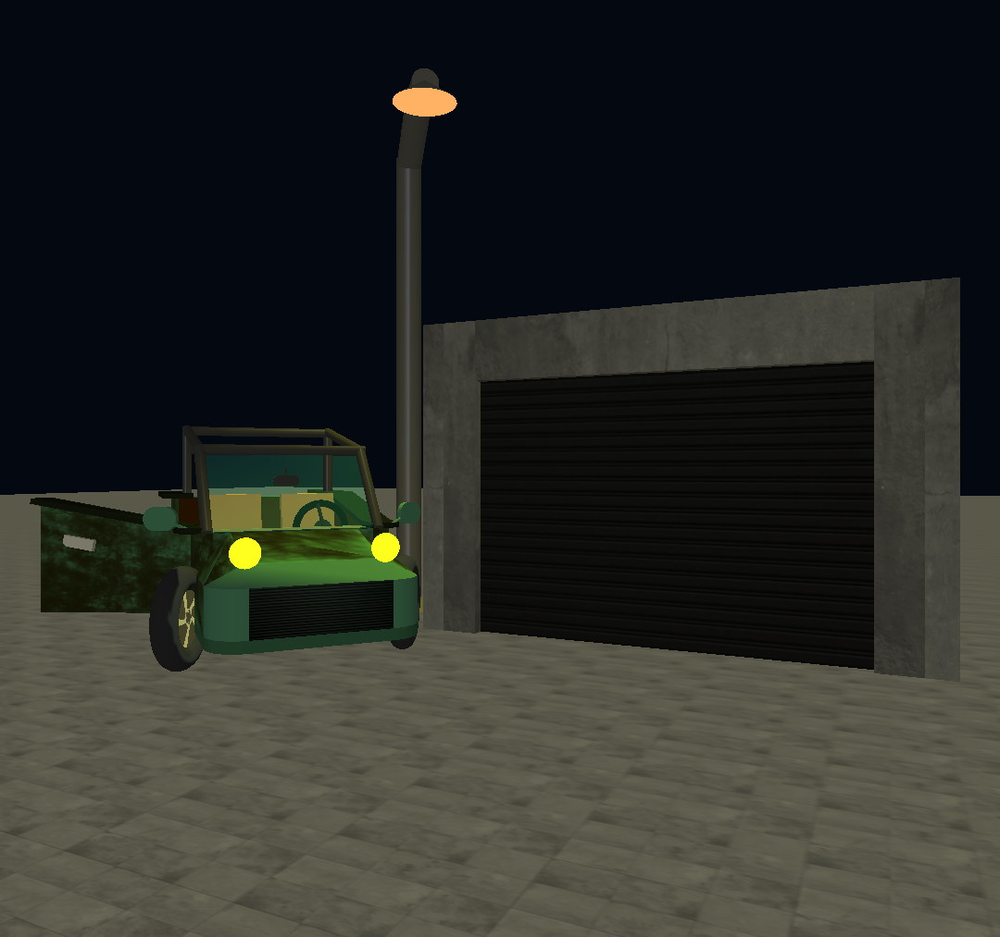
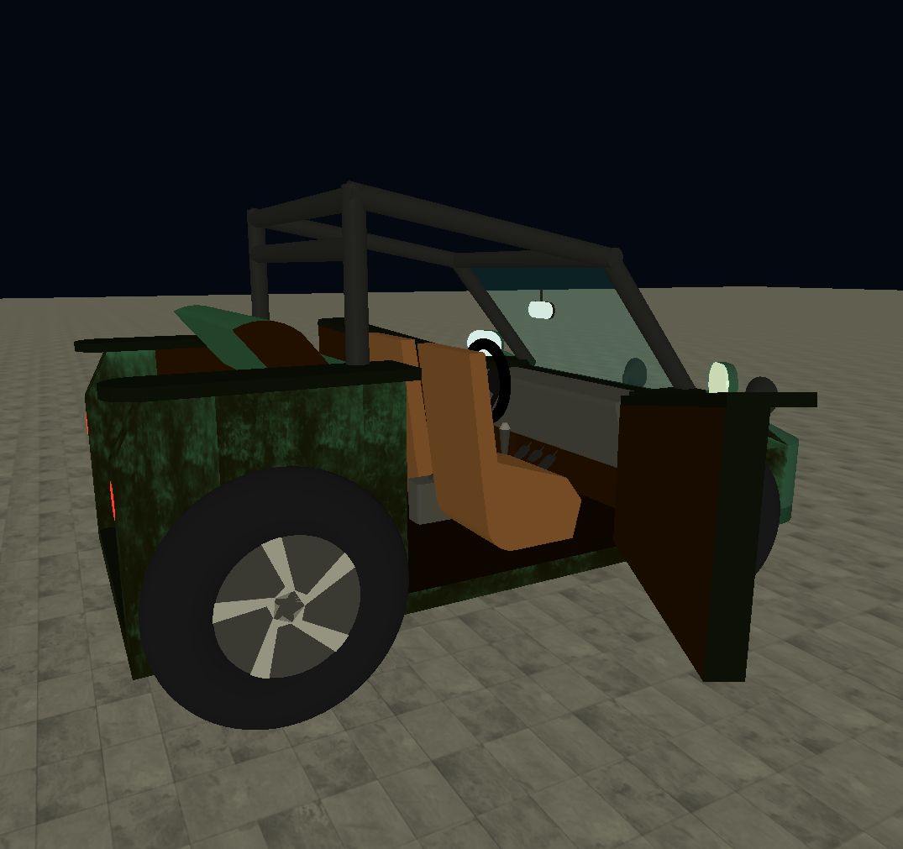
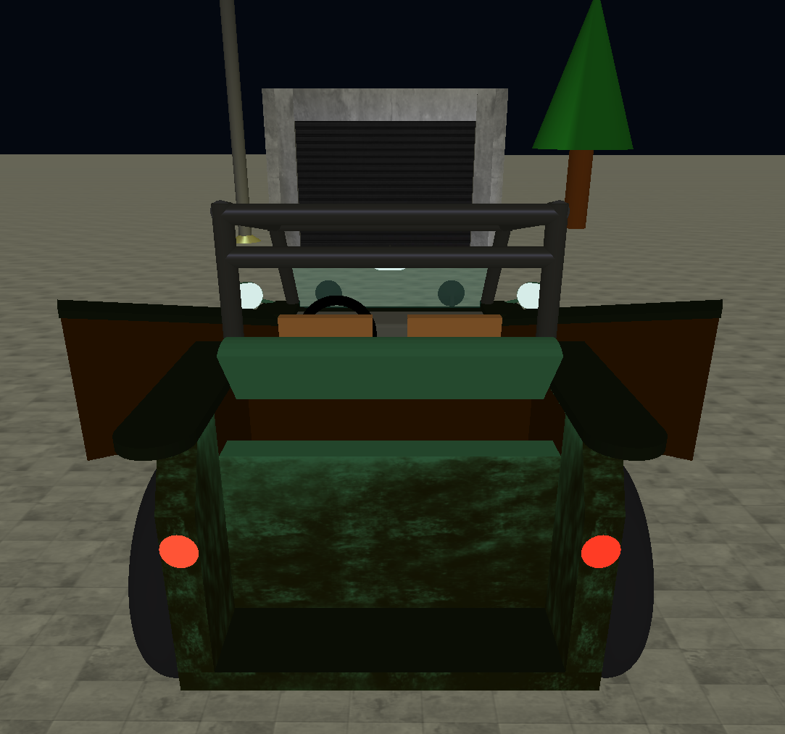
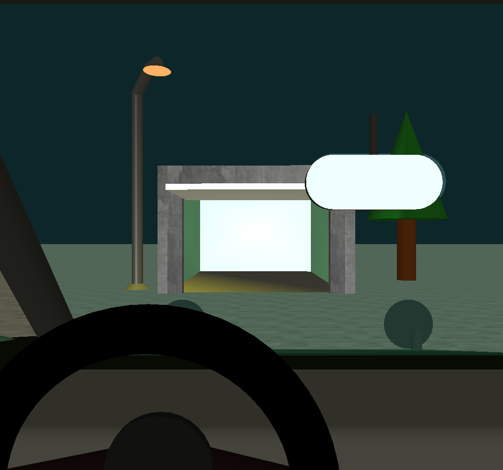

# Interactive 3D Car Scene (OpenGL)

Academic project developed for the curricular unit **Computação Gráfica (Computer Graphics)** in **Licenciatura em Engenharia Informática** at **Faculdade de Ciências da Universidade de Lisboa (FCUL)**.

## Description

This project is an **interactive 3D scene** developed in **Python using OpenGL**.  

It features a **controllable car** placed in a **simple environment** that includes elements such as a **garage** and **lighting**.

While 3D models are often created using modeling software such as **Blender** and imported as `.obj` files, all objects in this project, including the car, were **manually constructed using OpenGL primitives and transformations**, building each component piece by piece.

## Screenshots

<table align="center">
<tr>

<td align="center">
<br>
Overview 1
</td>

<td align="center">
<br>
Overview 2
</td>

<td align="center">
<br>
Car Interior
</td>

</tr>
</table>

<br>

<table align="center">
<tr>

<td align="center">
<br>
Third-person Camera
</td>

<td align="center">
<br>
First-person Camera
</td>

</tr>
</table>

## Controls

<table align="center">
<tr>
<th>Key</th>
<th>Action</th>
</tr>

<tr>
<td><b>W / A / S / D</b></td>
<td>Move the camera forward / left / backward / right relative to its direction</td>
</tr>

<tr>
<td><b>Q / E</b></td>
<td>Move the camera up / down on the <b>Y axis</b></td>
</tr>

<tr>
<td><b>I / J / K / L</b></td>
<td>Rotate the camera direction up / left / down / right</td>
</tr>

<tr>
<td><b>G / F</b></td>
<td>Open / close the <b>garage gate</b></td>
</tr>

<tr>
<td><b>N / M</b></td>
<td>Rotate the <b>steering wheel</b> counterclockwise / clockwise and control the car direction</td>
</tr>

<tr>
<td><b>O / P</b></td>
<td>Open / close the <b>left car door</b></td>
</tr>

<tr>
<td><b>9 / 0</b></td>
<td>Open / close the <b>right car door</b></td>
</tr>

<tr>
<td><b>T / Y</b></td>
<td>Open / close the <b>trunk</b></td>
</tr>

<tr>
<td><b>H</b></td>
<td>Switch camera mode: <b>third-person / first-person / free camera</b></td>
</tr>

<tr>
<td><b>Z / X</b></td>
<td>Move the <b>car forward / backward</b> according to the steering wheel rotation</td>
</tr>

<tr>
<td><b>ESC</b></td>
<td>Exit the program</td>
</tr>

</table>

## Requirements

To run this project you need:

- Python 3.x
- NumPy
- Pillow
- PyOpenGL

The project was developed using **Anaconda**, which is recommended as it already includes most scientific Python libraries.

To install the required packages manually:

```bash
pip install numpy pillow PyOpenGL
```

## Running the Project

Clone or download the repository and navigate to the project directory.

Run the main application:

`python main.py`

This will launch the interactive 3D scene, allowing you to control the car and interact with the environment.

## Authors

**Group 17**
- Simão da Luz - fc61816
